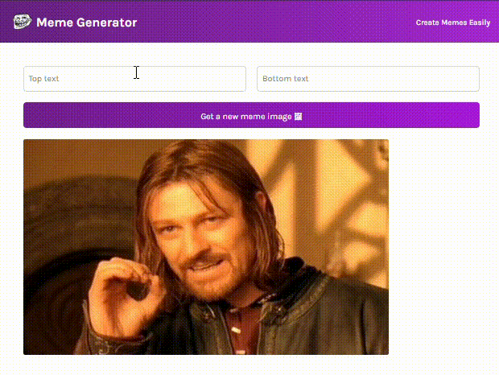

# React Meme Generator App

This project is a simple meme generator built with React and set up using Vite. It allows users to generate memes by adding custom text to a random meme image fetched from an API.

## Technologies Used
- React
- Vite
- HTML
- CSS
- JavaScript

## Installation
1. Clone the repository to your local machine.
2. Navigate to the project directory.
3. Install dependencies using `npm install`.

## Usage
1. Start the development server by running `npm run dev`.
2. Open your browser and go to `http://localhost:5173`.
3. Use the app interface to generate memes:
   - Click on a button to fetch a random meme image.
   - Add custom text to the top and bottom of the meme.
   - Create the meme.
